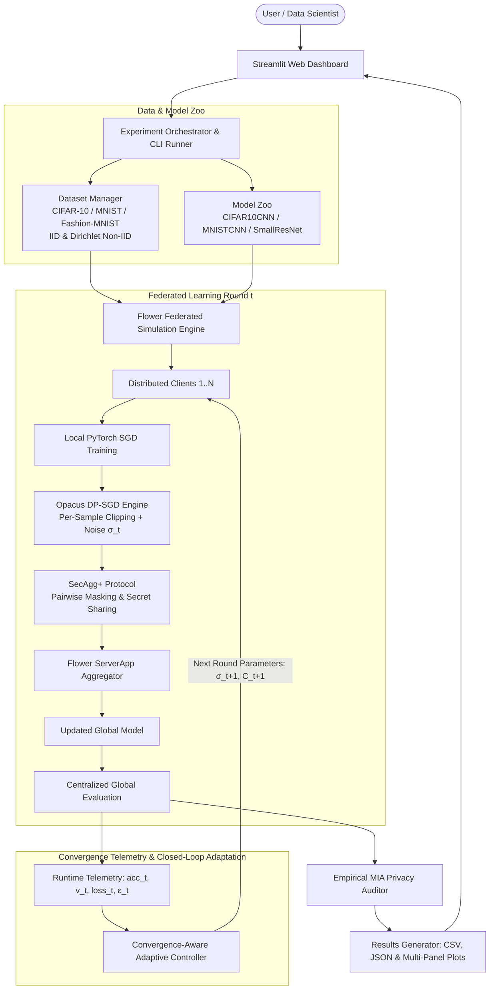

# 🛡️ Adaptive Privacy-Aware Federated Learning Framework
### Dynamic Differential Privacy (DP-SGD) & Secure Aggregation (SecAgg+) with Convergence-Aware Privacy Adaptation

[](https://www.python.org/)
[](https://pytorch.org/)
[](https://flower.ai/)
[](https://opacus.ai/)
[](https://streamlit.io/)
[](https://www.docker.com/)
[](LICENSE)
[](#-automated-testing--validation)

---

## 📖 Table of Contents
- [Overview](#-overview)
- [Key Features & Innovations](#-key-features--innovations)
- [System Architecture](#-system-architecture)
- [Baseline Comparison Matrix](#-baseline-comparison-matrix)
- [Convergence-Aware Adaptive Controller](#-convergence-aware-adaptive-controller)
- [⚙️ System Specifications & Hyperparameters](#️-system-specifications--hyperparameters)
- [Empirical Privacy Auditing (MIA)](#-empirical-privacy-auditing-mia)
- [Repository Structure](#-repository-structure)
- [Installation & Quickstart](#-installation--quickstart)
- [Running Federated Experiments](#-running-federated-experiments)
- [Streamlit Web Dashboard](#-streamlit-web-dashboard)
- [Docker Deployment](#-docker-deployment)
- [Automated Testing & Validation](#-automated-testing--validation)
- [Citation & License](#-citation--license)

---

## 🌟 Overview

Federated Learning (FL) enables collaborative machine learning across distributed edge clients without centralizing raw private data. However, **FL alone does not guarantee privacy**:
1. **Gradient Inversion & Reconstruction**: Malicious or honest-but-curious servers can infer sensitive training samples directly from transmitted client gradient updates.
2. **Membership Inference Attacks (MIA)**: Adversaries can determine with high probability whether a specific target record was part of a participant's local dataset.
3. **The Static DP Dilemma**: Applying traditional fixed Differential Privacy (DP-SGD) introduces a rigid utility penalty. Setting static excessive noise ($\sigma$) causes training collapse, while weak static noise fails empirical privacy audits under non-IID client heterogeneity.

**Adaptive-FL-Framework** resolves this tension by providing an end-to-end, reproducible research and benchmarking framework featuring:
- **Defence-in-Depth Privacy**: Opacus per-sample gradient clipping + calibrated Gaussian noise combined with Flower's **SecAgg+ (Secure Aggregation)** pairwise masking protocol.
- **A Closed-Loop Convergence-Aware Adaptive DP Controller**: Continuously observes multi-signal runtime telemetry (validation accuracy, convergence velocity, loss stability, and cumulative $\epsilon$ budget consumption) and dynamically tunes DP parameters on-the-fly.
- **Empirical Privacy Auditing**: Automated Black-Box Membership Inference Attack (MIA) risk grading, ROC-AUC, and Privacy Advantage metrics.
- **Full-Featured Interactive Web Dashboard**: Built with Streamlit and Plotly for real-time training observation, multi-baseline comparison, and privacy posture analysis.

---

## ⚡ Key Features & Innovations

- 🧠 **Dynamic Closed-Loop Controller**: Replaces arbitrary fixed noise schedules with an asymmetric proportional-integral feedback mechanism responding directly to client learning velocity and privacy exhaustion.
- 🔐 **Cryptographic SecAgg+**: Pairwise Diffie-Hellman secret sharing ensures the central server *only* reconstructs the aggregate sum of updates, concealing individual client gradients even in the presence of client dropouts.
- 📊 **Empirical MIA Privacy Auditor**: Evaluates loss-threshold and prediction-confidence attacks (Yeom et al., Shokri et al.) reporting attack success rates, ROC-AUC, True Positive Rate (TPR), and empirical Privacy Advantage ($\text{TPR} - \text{FPR}$).
- 📦 **Pluggable Dataset & Model Zoo**:
  - Datasets: **CIFAR-10**, **MNIST**, **Fashion-MNIST**.
  - Partitions: Uniform **IID** and Dirichlet heterogeneous **Non-IID** ($\alpha=0.5$).
  - Models: **5-layer CIFAR10CNN**, **4-layer MNISTCNN**, and **SmallResNet**.
- 📈 **Publication-Ready Benchmarking**: Automated multi-baseline comparisons that export structured JSON, CSV summaries, and multi-panel visualization curves.
- 🖥️ **Rich Streamlit Web Dashboard**: 5 dedicated screens for launching simulations, live telemetry monitoring, 4-way comparative metrics, and controller decision trails.
- 🐳 **Production & Container Ready**: Full containerization support via Docker & Docker Compose, as well as Windows one-click batch scripts (`.bat`).

---

## 🏛️ System Architecture



---

## 🔬 Baseline Comparison Matrix

The framework provides 4 canonical baselines to systematically evaluate privacy-utility tradeoffs:

| Baseline Configuration | Threat Model Protected | Differential Privacy (DP) | Secure Aggregation (SecAgg+) | Noise Multiplier ($\sigma$) | Clipping Norm ($C$) | Privacy Guarantee |
| :--- | :--- | :---: | :---: | :---: | :---: | :--- |
| **1. Standard FedAvg** | Baseline (No Adversary) | ❌ None | ❌ None | $0.00$ | None | No privacy; vulnerable to MIA & inversion |
| **2. FedAvg + Fixed DP** | Semi-Honest Data Analyst | ✅ Opacus DP-SGD | ❌ None | Static (e.g., $1.00$) | Static ($1.00$) | Theoretical $(\epsilon, \delta)$-DP; utility penalty |
| **3. FedAvg + Fixed DP + SecAgg+** | Semi-Honest Server + Analyst | ✅ Opacus DP-SGD | ✅ SecAgg+ | Static (e.g., $1.00$) | Static ($1.00$) | Cryptographic input privacy + $(\epsilon, \delta)$-DP |
| **4. Proposed Adaptive DP** | Dynamic Privacy-Utility Defense | ✅ Opacus DP-SGD | ✅ Optional | **Dynamic ($\sigma_t \in [0.3, 3.0]$)** | **Dynamic ($C_t \in [0.5, 5.0]$)** | **Optimal pareto frontier of utility & privacy** |

---

## 🧠 Convergence-Aware Adaptive Controller

Unlike traditional static noise schedules, the **Adaptive Controller** implements a closed-loop feedback policy that adjusts noise based on training dynamics.

### Mathematical Formulation

At each federated round $t$, the controller collects runtime signals:
1. Current evaluation accuracy: $\text{acc}_t$
2. Prior evaluation accuracy: $\text{acc}_{t-1}$
3. Convergence velocity:
   $$v_t = \frac{\text{acc}_t - \text{acc}_{t-1}}{\max(\text{acc}_{t-1}, 10^{-8})}$$
4. Cumulative privacy budget expenditure: $\epsilon_t = \sum_{i=1}^t \epsilon_i$
5. Budget exhaustion pressure:
   $$p_t = \frac{\epsilon_t}{\epsilon_{\text{budget}}}$$

### Asymmetric Adaptation Policy

$$\sigma_{t+1} = \begin{cases} 
\min(\sigma_t \cdot (1 + \alpha), \, \sigma_{\max}) & \text{if } p_t > 0.80 \quad \text{(Budget Guard: Prevent budget blowout)} \\[6pt]
\min(\sigma_t \cdot (1 + \alpha), \, \sigma_{\max}) & \text{if } v_t > \tau_{\text{high}} \quad \text{(High Velocity: Model learning rapidly, inject more noise)} \\[6pt]
\max(\sigma_t \cdot (1 - \beta), \, \sigma_{\min}) & \text{if } v_t < \tau_{\text{low}} \quad \text{(Stalled Learning: Mitigate noise to allow convergence)} \\[6pt]
\sigma_t & \text{otherwise} \quad \text{(Stable Steady State)}
\end{cases}$$

- **Asymmetric Rates**: $\alpha = 0.15$ (noise increase rate) and $\beta = 0.08$ (noise decay rate). Privacy increases conservatively faster than it decays ($\alpha > \beta$).
- **Joint Gradient Clipping Adaptation**: The clipping bound scales proportionally with noise adjustment: $C_{t+1} = \text{clip}\left(C_t \cdot \frac{\sigma_{t+1}}{\sigma_t}, C_{\min}, C_{\max}\right)$.
- **Warmup Protection**: Adaptation begins after an initial warmup phase ($t > t_{\text{warmup}}$) ensuring gradient stability before perturbation.

---

## ⚙️ System Specifications & Hyperparameters

### 1. Federated Training Hyperparameters
* **Federated Rounds**: **50 rounds** default (configurable from 1 to 30+ rounds).
* **Local Epochs per Round**: **3 local epochs** per client per round (slider range: 1 to 5).
* **Simulated Clients**: **10 clients** default (scalable from 2 to 20+ clients).
* **Client Participation Fraction**: **1.0** (100% client evaluation fraction per round).
* **Batch Size**: **32 samples** per mini-batch (options: 16, 32, 64, 128).
* **Learning Rate ($\eta$)**: **0.05** using PyTorch SGD (tunable from 0.001 to 0.5).
* **Non-IID Partitioning**: Dirichlet distribution parameter **$\alpha = 0.5$** for heterogeneous data distribution.

### 2. Adaptive Controller & Privacy Numerical Bounds
* **Noise Multiplier ($\sigma$) Bounds**: Hard-clamped within **$[0.30, 3.00]$** (initial value: 0.50 or 1.00).
* **Gradient Clipping ($C$) Bounds**: Hard-clamped within **$[0.50, 5.00]$** (initial value: 1.20).
* **Target Delta ($\delta$)**: Fixed at **$10^{-5}$ ($1\text{e-}5$)** for $(\epsilon, \delta)$-Differential Privacy.
* **Warmup Buffer**: **2 to 5 initial rounds** run with fixed noise before adaptation activates.
* **Asymmetric Tuning Rates**:
  * **Noise Increase Rate ($\alpha$)**: **$+15\%$ ($0.15$)** when learning accelerates.
  * **Noise Decay Rate ($\beta$)**: **$-8\%$ ($0.08$)** when convergence stalls.
* **Velocity Signal Thresholds**:
  * **$\tau_{\text{high}} = 0.05$**: Triggers noise increase if round-over-round accuracy improves by $> 5\%$.
  * **$\tau_{\text{low}} = 0.01$**: Triggers noise reduction if improvement falls below $1\%$.
* **Budget Guard**: Automatically forces maximum privacy protection once cumulative expenditure reaches **$80\%$ ($0.80$)** of total budget ($\epsilon_{\text{budget}} \in [10.0, 50.0]$).

### 3. Cryptographic SecAgg+ Thresholds
* **Secret Shares ($n$)**: **7 shares** generated per client update.
* **Reconstruction Threshold ($k$)**: **4 shares** minimum required to reconstruct the aggregated sum.
* **Dropout Resilience**: Tolerates up to **3 client dropouts** ($n - k = 7 - 4$) per round without breaking aggregation.

### 4. Neural Network Scale & Parameters
* **`CIFAR10CNN`**:
  * **Trainable Parameters**: **~62,006 parameters**
  * **Architecture**: 5 layers (2 Conv2d layers + MaxPool + 3 Linear layers: $120 \rightarrow 84 \rightarrow 10$)
  * **Input Shape**: $3 \times 32 \times 32$ RGB images
* **`MNISTCNN`**:
  * **Trainable Parameters**: **~28,938 parameters**
  * **Architecture**: 4 layers (2 Conv2d layers + MaxPool + 2 Linear layers: $128 \rightarrow 10$)
  * **Input Shape**: $1 \times 28 \times 28$ grayscale images
* **Output Classes**: **10 target classes** across CIFAR-10, MNIST, and Fashion-MNIST.

---

## 🔍 Empirical Privacy Auditing (MIA)

Theoretical $(\epsilon, \delta)$-DP bounds can sometimes be loose or difficult to interpret intuitively. This framework incorporates an **empirical Membership Inference Attack (MIA)** auditor:

- **Threat Formulation**: Evaluates whether an adversary with access to the trained model can distinguish between private client training samples (members) and unseen holdout samples (non-members).
- **Attack Techniques**:
  - **Loss-Threshold Attack** (Yeom et al.): Classifies sample as a member if cross-entropy loss is below an empirically calibrated threshold $\tau$.
  - **Prediction Confidence Attack** (Shokri et al.): Evaluates max softmax prediction confidence distribution differences.
- **Empirical Metrics**:
  - **Attack Success Rate (ASR)**: Balanced attack accuracy.
  - **ROC-AUC**: Area under the ROC curve for the attack classifier.
  - **Empirical Privacy Advantage**: $\text{Adv} = \text{TPR} - \text{FPR}$ (0.0 represents zero leakage).
  - **Risk Categorization**:
    $$\text{Risk} = \begin{cases}
    \textbf{LOW} & \text{ASR} \le 55\% \\
    \textbf{MODERATE} & 55\% < \text{ASR} \le 65\% \\
    \textbf{HIGH} & 65\% < \text{ASR} \le 75\% \\
    \textbf{CRITICAL} & \text{ASR} > 75\%
    \end{cases}$$

---

## 📁 Repository Structure

```
Adaptive-FL-Framework/
├── adaptive-fl-framework/            # Core Python framework source code
│   ├── dashboard/                    # Interactive Streamlit Web Application
│   │   └── app.py                    # Multi-screen web dashboard with Plotly
│   ├── data_utils/ & datasets/       # Data partitioning and loader pipelines
│   │   └── dataset_manager.py        # CIFAR-10, MNIST, Fashion-MNIST (IID & Dirichlet Non-IID)
│   ├── docs/                         # Scientific documentation & research notes
│   │   └── research_notes.md         # Literature gap, math models, and citations
│   ├── evaluation/                   # Evaluation & auditing engines
│   │   ├── metrics.py                # Top-1/Top-5 Acc, Macro-F1, Precision, Loss, Comm Cost
│   │   ├── attack_evaluation.py      # Empirical Membership Inference Attack (MIA) auditor
│   │   └── compare_baselines.py      # 4-way multi-baseline aggregator & report generator
│   ├── experiments/                  # Experiment runner & configs
│   │   ├── configs/                  # Declarative JSON experiment presets
│   │   │   ├── baseline_fedavg.json
│   │   │   ├── fedavg_dp.json
│   │   │   ├── fedavg_dp_sa.json
│   │   │   └── adaptive_dp.json
│   │   └── runner.py                 # Automated experiment execution & plot generator
│   ├── federated/                    # Flower FL simulation logic
│   │   ├── client.py                 # Standard & DP Flower ClientApp
│   │   ├── client_secagg.py          # SecAgg+ enabled ClientApp
│   │   ├── server.py                 # Flower ServerApp
│   │   ├── server_adaptive.py        # Adaptive controller integrated ServerApp
│   │   ├── server_secagg.py          # SecAgg+ workflow integrated ServerApp
│   │   └── task.py                   # PyTorch training, test loops, & batch evaluation
│   ├── models/                       # Deep Learning Model Zoo
│   │   └── model_factory.py          # CIFAR10CNN, MNISTCNN, SmallResNet architectures
│   ├── privacy/                      # Privacy engineering modules
│   │   ├── differential_privacy.py   # Opacus DP-SGD engine, clipping & noise injection
│   │   ├── privacy_accountant.py     # Multi-round RDP / moments privacy accountant
│   │   └── adaptive_controller.py    # Closed-loop convergence-aware adaptive controller
│   ├── results/                      # Generated benchmark CSVs, JSON summaries, and plots
│   ├── security/                     # Cryptographic modules
│   │   └── secure_aggregation.py     # SecAgg+ protocol threat model & masking logic
│   ├── tests/                        # Comprehensive unit test suites (Phases 1-9)
│   ├── Dockerfile                    # Containerization build specification
│   ├── docker-compose.yml            # Docker orchestration configuration
│   ├── pyproject.toml                # Flower app configuration & build metadata
│   ├── requirements.txt              # Production dependencies
│   └── run.py                        # Unified command-line interface (CLI) launcher
│
├── run_dashboard.bat                 # Windows one-click dashboard launcher
├── run_experiment.bat                # Windows one-click experiment runner
├── run_tests.bat                     # Windows one-click test suite runner
├── run_tests.py                      # Root test suite orchestrator
└── README.md                         # Project documentation
```

---

## 🚀 Installation & Quickstart

### Prerequisites
- **Python**: 3.10 or 3.11 recommended.
- **Git**: For cloning the repository.
- **CUDA** *(Optional)*: Supported automatically if PyTorch with CUDA is installed.

### 1. Clone the Repository
```bash
git clone https://github.com/tarunpj/adaptive-privacy-aware-framework.git
cd adaptive-privacy-aware-framework
```

### 2. Create and Activate a Virtual Environment
```bash
# On Linux / macOS:
python3 -m venv .venv
source .venv/bin/activate

# On Windows (PowerShell):
python -m venv .venv
.venv\Scripts\Activate.ps1

# On Windows (Command Prompt):
.venv\Scripts\activate.bat
```

### 3. Install Dependencies
```bash
cd adaptive-fl-framework
pip install --upgrade pip
pip install -r requirements.txt
```

---

## 💻 Running Federated Experiments

All experiments can be executed via the unified CLI launcher [`adaptive-fl-framework/run.py`](file:///d:/Adaptive-FL-Framework/adaptive-fl-framework/run.py) or through the Windows batch runners:

### Mode 1: Standard FedAvg Baseline (No Privacy)
```bash
python run.py --rounds 5 --clients 10 --experiment-id baseline_fedavg
```

### Mode 2: FedAvg + Fixed Differential Privacy
```bash
python run.py --dp --noise 1.0 --clip 1.0 --delta 1e-5 --rounds 5 --clients 10 --experiment-id fedavg_dp
```

### Mode 3: FedAvg + Fixed DP + Secure Aggregation (SecAgg+)
```bash
python run.py --secagg --shares 7 --threshold 4 --noise 1.0 --rounds 3 --clients 5 --experiment-id fedavg_dp_sa
```

### Mode 4: Proposed Convergence-Aware Adaptive DP
```bash
python run.py --adaptive --alpha 0.15 --beta 0.08 --warmup 2 --rounds 5 --clients 10 --experiment-id adaptive_dp
```

### CLI Command Options Reference

| Flag | Type | Default | Description |
| :--- | :---: | :---: | :--- |
| `--rounds` | `int` | `50` | Total number of federated aggregation rounds |
| `--clients` | `int` | `10` | Total number of distributed clients simulated |
| `--lr` | `float` | `0.05` | Client local learning rate (SGD) |
| `--local-epochs` | `int` | `3` | Number of local training epochs per round |
| `--batch-size` | `int` | `32` | Local mini-batch training size |
| `--experiment-id`| `str` | `"baseline"` | Identifier for saving CSV/JSON/PNG results |
| `--dp` | `flag` | `False` | Enables Opacus Differential Privacy |
| `--noise` | `float` | `0.5` | DP Gaussian noise multiplier ($\sigma$) |
| `--clip` | `float` | `1.2` | DP per-sample gradient max clipping norm ($C$) |
| `--delta` | `float` | `1e-5` | Target $\delta$ in $(\epsilon, \delta)$-DP |
| `--secagg` | `flag` | `False` | Enables Flower SecAgg+ secure aggregation |
| `--shares` | `int` | `7` | Secret shares per client update |
| `--threshold` | `int` | `4` | Reconstruction threshold for Shamir shares |
| `--adaptive` | `flag` | `False` | Enables Convergence-Aware Adaptive DP Controller |
| `--alpha` | `float` | `0.15` | Noise multiplier increase rate (high convergence) |
| `--beta` | `float` | `0.08` | Noise multiplier decay rate (stalled learning) |
| `--warmup` | `int` | `2` | Initial rounds before adaptation triggers |

---

## 🖥️ Streamlit Web Dashboard

An interactive browser-based dashboard is provided for live monitoring, comparison, and auditing.

### Launching the Dashboard

```bash
# From within adaptive-fl-framework/
streamlit run dashboard/app.py
```
*(Or on Windows, simply double-click `run_dashboard.bat` from the root folder!)*

Navigate to **`http://localhost:8501`** in your browser.

### Dashboard Modules:
1. 🚀 **Launch & Live Monitor**: Real-time progress bar, live loss/accuracy metrics, and streaming simulation output.
2. 📊 **4-Way Comparison Screen**: Side-by-side metric tables, interactive multi-line curves, and radar charts comparing Accuracy, Loss, $\epsilon$-Budget, and Execution Latency.
3. 🧠 **Adaptive Privacy Controller**: Deep-dive inspection of dynamic noise schedules, clipping norm trajectories, and round-by-round controller decision logs.
4. 🔍 **Privacy Audit (MIA Evaluation)**: Interactive Membership Inference Attack risk evaluator displaying ASR, ROC-AUC, True Positive vs False Positive rates, and risk badges.
5. 📁 **Experiment Archives**: Raw CSV and JSON telemetry viewer with instant data download.

---

## 🐳 Docker Deployment

The framework includes complete containerization for reproducible zero-setup deployment across any Linux, macOS, or Windows machine.

### Using Docker Compose (Recommended)
```bash
cd adaptive-fl-framework
docker compose up --build
```
The Streamlit dashboard will automatically start and be accessible at `http://localhost:8501`.

### Using Standalone Docker
```bash
cd adaptive-fl-framework

# Build image
docker build -t adaptive-fl-framework .

# Run container
docker run -p 8501:8501 adaptive-fl-framework
```

---

## ✅ Automated Testing & Validation

The framework incorporates an automated multi-phase unit testing suite ensuring robustness across all modules:

```bash
# Run the complete test suite from repository root:
python run_tests.py
```
*(Or double-click `run_tests.bat` on Windows)*

### Verified Test Phases:
- ✅ **Phase 1**: Baseline Architecture & Local Training Loops (`tests/test_phase1_baseline.py`)
- ✅ **Phase 2**: Opacus DP Engine, Clipping Bounds, & Moments Accountant (`tests/test_phase2_dp.py`)
- ✅ **Phase 3**: Secure Aggregation SecAgg+ Protocol & Masking (`tests/test_phase3_secagg.py`)
- ✅ **Phase 4**: Adaptive Controller Proportional Feedback & Boundary Clamping (`tests/test_adaptive_controller.py`)
- ✅ **Phase 7**: Comprehensive Classification Metrics & MIA Auditor (`tests/test_phase7_evaluation.py`)
- ✅ **Phase 8**: Dataset Manager (IID & Non-IID Dirichlet) & Model Zoo Factory (`tests/test_phase8_dataset_model.py`)
- ✅ **Phase 9**: Declarative Experiment Runner & Automated Plot Generation (`tests/test_phase9_experiment_runner.py`)

---

## 📄 Citation & Research Context

If you use this framework or its adaptive privacy controller in your academic research or projects, please cite:

```bibtex
@software{jha2025adaptivefl,
  author = {Tarun Jha},
  title = {Adaptive Privacy-Aware Federated Learning Framework with Differential Privacy and Secure Aggregation},
  year = {2025},
  url = {https://github.com/tarunpj/adaptive-privacy-aware-framework},
  note = {A Convergence-Aware Closed-Loop DP-FL Framework}
}
```

---

## 📜 License

This project is licensed under the **MIT License** — see the [LICENSE](file:///d:/Adaptive-FL-Framework/adaptive-fl-framework/LICENSE) file for complete details.
