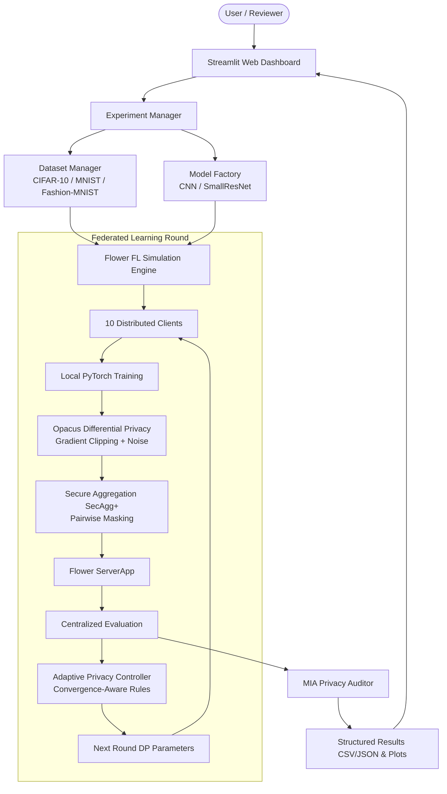

# Adaptive Privacy-Aware Federated Learning Framework
### Using Differential Privacy and Secure Aggregation

[](https://www.python.org/)
[](https://pytorch.org/)
[](https://flower.ai/)
[](https://opacus.ai/)
[](https://streamlit.io/)

A complete, demonstrable, research-oriented Federated Learning (FL) framework combining **Differential Privacy (DP-SGD via Opacus)**, **Secure Aggregation (SecAgg+)**, and a novel **Convergence-Aware Adaptive Privacy Controller**.

---

## 🏛️ System Architecture



---

## 🔬 Core Methodologies & Comparison

| Method | Threat Model Protected | Differential Privacy | Secure Aggregation | Noise Multiplier ($\sigma$) | Clipping Norm ($C$) |
| :--- | :--- | :---: | :---: | :---: | :---: |
| **1. Standard FedAvg** | Baseline (No Adversary) | ❌ | ❌ | $0.00$ | None |
| **2. FedAvg + Fixed DP** | Semi-Honest Analyst | ✅ (Opacus) | ❌ | $1.00$ (Static) | $1.00$ (Static) |
| **3. FedAvg + Fixed DP + SecAgg+** | Semi-Honest Server + Analyst | ✅ (Opacus) | ✅ (SecAgg+) | $1.00$ (Static) | $1.00$ (Static) |
| **4. Proposed Adaptive DP** | Dynamic Privacy-Utility Defense | ✅ (Opacus) | ✅ Optional | **$1.00 \rightarrow 1.15$ (Dynamic)** | **$1.00 \rightarrow 1.15$ (Dynamic)** |

---

## 🧠 Proposed Contribution: Convergence-Aware Adaptive Controller

The adaptive controller observes **multi-signal runtime telemetry** after each round $t$:
1. Current test accuracy: $acc_t$
2. Convergence velocity: $v_t = \frac{acc_t - acc_{t-1}}{acc_{t-1} + \epsilon}$
3. Cumulative privacy expenditure: $\epsilon_t = \sum \epsilon_i$
4. Cross-entropy loss stability

### Asymmetric Adaptation Policy:
$$\sigma_{t+1} = \begin{cases} 
\sigma_t \cdot (1 + \alpha) & \text{if } v_t > \tau_{\text{high}} \quad (\text{Fast Convergence} \rightarrow \text{Increase Privacy}) \\
\sigma_t \cdot (1 - \beta) & \text{if } v_t < \tau_{\text{low}} \quad (\text{Stalled Learning} \rightarrow \text{Reduce Noise}) \\
\sigma_t \cdot (1 + \alpha) & \text{if } \epsilon_t / \text{Budget} > 0.80 \quad (\text{Budget Guard}) \\
\sigma_t & \text{otherwise} \quad (\text{Maintain Stable State})
\end{cases}$$

*(Clamped within $[\sigma_{\min}, \sigma_{\max}] = [0.30, 3.00]$, with $\alpha = 0.15, \beta = 0.08$)*.

---

## 🚀 Quickstart Guide

### 1. Installation & Environment Setup
```bash
# Clone and enter the repository
cd adaptive-fl-framework

# Activate virtual environment
..\.venv\Scripts\activate

# Install dependencies
pip install -r requirements.txt
```

### 2. Running Automated Unit Tests
Run the comprehensive test suite verifying all 13 project phases:
```bash
# Run all unit tests
python tests/test_phase1_baseline.py
python tests/test_phase2_dp.py
python tests/test_phase3_secagg.py
python tests/test_adaptive_controller.py
python tests/test_phase7_evaluation.py
python tests/test_phase8_dataset_model.py
python tests/test_phase9_experiment_runner.py
```

### 3. Running Federated Experiments

#### A. Standard FedAvg Baseline:
```bash
python run.py --rounds 3 --clients 10 --experiment-id baseline_fedavg
```

#### B. Fixed Differential Privacy:
```bash
python run.py --rounds 3 --clients 10 --dp --noise 1.0 --clip 1.0 --delta 1e-5 --experiment-id fedavg_dp
```

#### C. Fixed DP + Secure Aggregation:
```bash
python run.py --secagg --rounds 2 --clients 5 --experiment-id fedavg_dp_sa
```

#### D. Proposed Adaptive Privacy Controller:
```bash
python run.py --adaptive --rounds 3 --clients 10 --experiment-id adaptive_dp
```

---

## 📊 Launching the Streamlit Web Dashboard

```bash
streamlit run dashboard/app.py
```
Open **`http://localhost:8501`** in your browser to access:
- **Experiment Launcher**: Configure datasets, models, and real-time live simulations.
- **4-Way Comparison Matrix**: Side-by-side accuracy, loss, privacy, and timing tables.
- **Adaptive Controller Panel**: Live decision trail and dynamic parameter schedules.
- **MIA Privacy Auditor**: Empirical Membership Inference Attack risk evaluation.

---

## 🐳 Docker Deployment

To launch the complete application inside a containerized environment:
```bash
# Build and run with Docker Compose
docker compose up --build
```
Access the dashboard at `http://localhost:8501`.

---

## 📁 Repository Structure

```
adaptive-fl-framework/
├── dashboard/
│   └── app.py                     # Streamlit Interactive Web Application
├── data_utils/ & datasets/
│   └── dataset_manager.py         # CIFAR-10, MNIST, Fashion-MNIST & Dirichlet Non-IID
├── models/
│   └── model_factory.py           # Model Zoo (CNN, SmallResNet)
├── privacy/
│   ├── differential_privacy.py    # Opacus DP-SGD Engine & Clipping
│   ├── privacy_accountant.py      # Multi-Round Privacy Budget Accountant
│   └── adaptive_controller.py     # Convergence-Aware Adaptive Controller
├── security/
│   └── secure_aggregation.py      # SecAgg+ Threat Model & Pairwise Masking
├── evaluation/
│   ├── metrics.py                 # Precision, Recall, Macro-F1, Comm Costs
│   ├── attack_evaluation.py       # Empirical Membership Inference Attack (MIA)
│   └── compare_baselines.py       # Automated 4-Way Multi-Baseline Report Generator
├── experiments/
│   ├── runner.py                  # Experiment Manager & Automated Plotting
│   └── configs/                   # Declarative JSON Experiment Presets
├── results/                       # Generated CSVs, Summaries, and Comparison Plots
├── tests/                         # Unit Test Suites (Phases 1-9)
├── Dockerfile                     # Container Specification
├── docker-compose.yml             # Container Orchestration
└── run.py                         # Unified CLI Launcher
```
